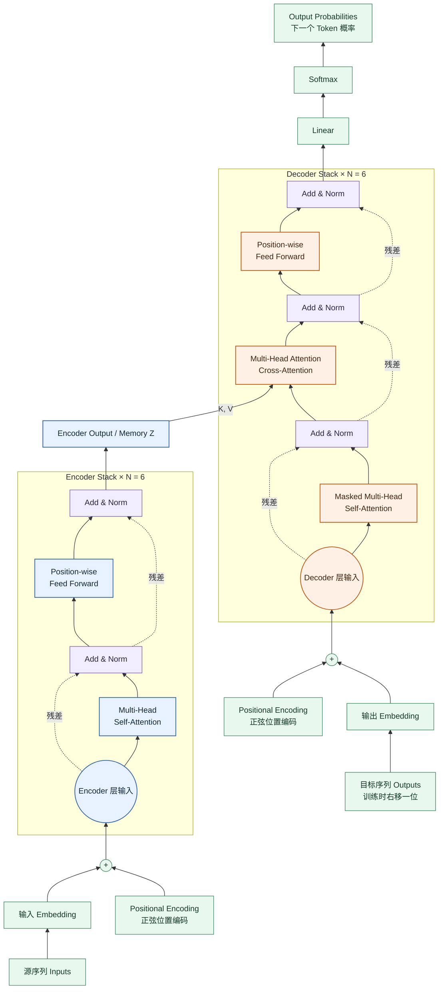
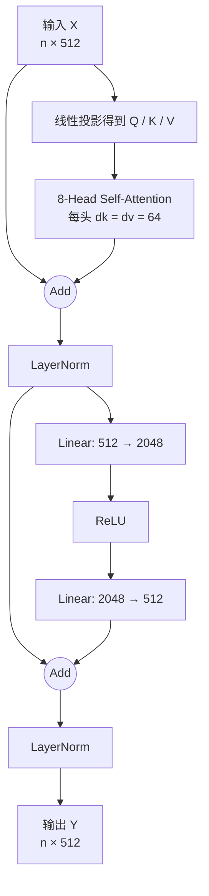
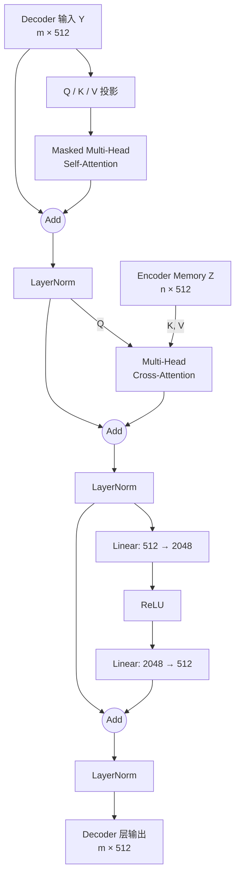
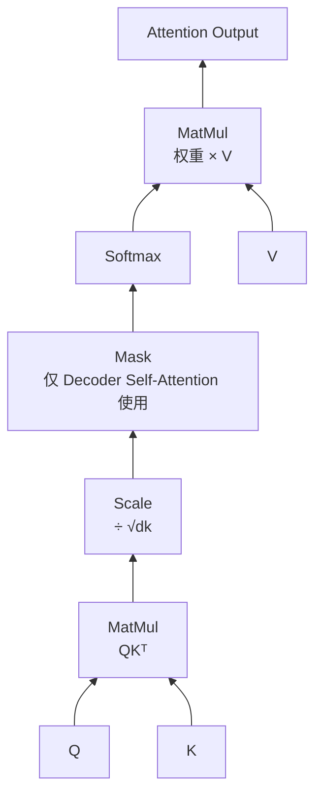
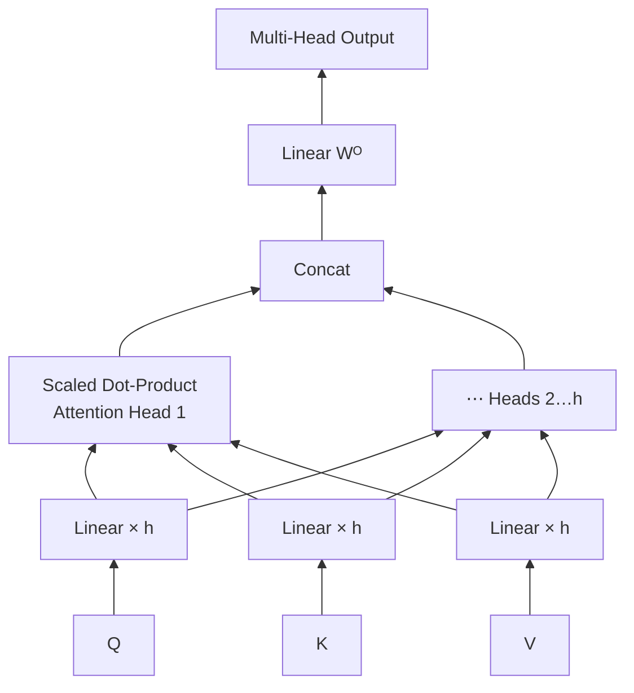
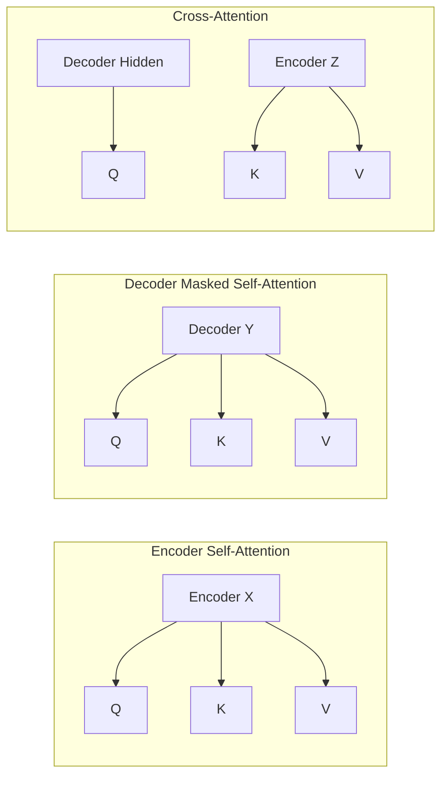
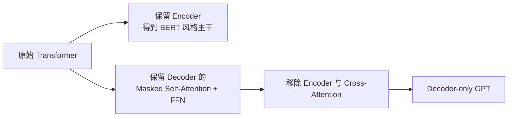

# Transformer 原论文 Figure 1：官方结构中文重绘与逐层图解

> 对照来源：Vaswani et al., *Attention Is All You Need*, Figure 1, NeurIPS 2017。  
> [查看 NeurIPS 官方论文](https://proceedings.neurips.cc/paper_files/paper/2017/file/3f5ee243547dee91fbd053c1c4a845aa-Paper.pdf)  
> 本图是忠于论文连接关系的**中文可编辑重绘版**，不是从官方 PDF 复制出来的原始图片。原图以论文 Figure 1 为准。

---

## 1. 完整 Encoder–Decoder 结构图



### 图中最关键的三条信息流

1. **源序列路径**：Embedding + Position → 6 层 Encoder → Memory $Z$；
2. **目标序列路径**：右移后的目标 Token → Masked Decoder Self-Attention；
3. **跨序列路径**：Decoder 用当前状态作 Q，用 Encoder Memory 作 K/V。

> Mermaid 中虚线表示残差旁路。原论文每个子层执行的是 `LayerNorm(x + Sublayer(x))`，属于 Post-Norm。

---

## 2. Encoder 单层展开图



Encoder Self-Attention：

$$
Q=XW_Q,\qquad K=XW_K,\qquad V=XW_V
$$

所有源位置彼此可见，因此没有因果 Mask。

---

## 3. Decoder 单层展开图



Decoder 比 Encoder 多出的模块是 Cross-Attention：

$$
Q=H_{decoder}W_Q,qquad
K=ZW_K,qquad
V=ZW_V
$$

它回答的是：“生成当前目标词时，源句哪些位置最重要？”

---

## 4. Scaled Dot-Product Attention：Figure 2 左侧重绘



$$
\operatorname{Attention}(Q,K,V)
=\operatorname{softmax}\left(\frac{QK^T}{\sqrt{d_k}}+M\right)V
$$

原论文 Figure 2 在 Mask 模块旁标记 “optional”，因为：

- Encoder Self-Attention 不需要因果 Mask；
- Decoder Self-Attention 必须使用因果 Mask；
- Cross-Attention 不使用目标侧因果 Mask，但实现中可能使用源 Padding Mask。

---

## 5. Multi-Head Attention：Figure 2 右侧重绘



Base 模型：

```text
d_model = 512
h = 8
d_k = d_v = 64
Concat 后维度 = 8 × 64 = 512
```

---

## 6. 三种 Attention 的 Q/K/V 来源图



| 模块 | Q | K | V | Mask |
|---|---|---|---|---|
| Encoder Self-Attention | Encoder | Encoder | Encoder | 无因果 Mask |
| Decoder Self-Attention | Decoder | Decoder | Decoder | Causal Mask |
| Cross-Attention | Decoder | Encoder | Encoder | 通常仅 Padding Mask |

---

## 7. Causal Mask 可见性图

目标序列为 $[y_1,y_2,y_3,y_4]$：

```text
             Key 位置
Query        y1   y2   y3   y4
y1           ✓    ×    ×    ×
y2           ✓    ✓    ×    ×
y3           ✓    ✓    ✓    ×
y4           ✓    ✓    ✓    ✓
```

矩阵形式：

$$
M=
\begin{bmatrix}
0&-\infty&-\infty&-\infty\\
0&0&-\infty&-\infty\\
0&0&0&-\infty\\
0&0&0&0
\end{bmatrix}
$$

Softmax 后，所有 $-\infty$ 对应权重变为 0。

---

## 8. 原论文图与 GPT 结构的对应关系



GPT 不是把 Figure 1 右半边原封不动复制下来。标准 GPT Block 通常：

- 没有 Encoder；
- 没有 Cross-Attention；
- 只保留 Causal Self-Attention 与 FFN；
- 后来常改为 Pre-Norm；
- 现代模型还常用 RoPE、RMSNorm、SwiGLU、GQA。

---

## 9. 看 Figure 1 时最容易犯的错误

1. **把右侧 Decoder 当作 GPT Block**：原图 Decoder 还有 Cross-Attention。
2. **把 Add & Norm 看成先 Norm**：原论文是先子层与残差相加，再 Norm。
3. **认为 Encoder 和 Decoder 共享层参数**：层结构相同，但各层参数不共享。
4. **认为 Position Encoding 每层都加**：原图只在 Encoder/Decoder 堆栈底部加入。
5. **认为所有 Attention 都有 Causal Mask**：只有 Decoder Self-Attention 需要防止看未来。
6. **认为 Cross-Attention 的 Q/K/V 同源**：Q 来自 Decoder，K/V 来自 Encoder。
7. **认为 Softmax 就是 Attention 内唯一的 Softmax**：Attention 内 Softmax 归一化位置权重；模型顶部 Softmax 归一化词表概率。

---

## 10. 图结构速记

```text
Encoder 层：
Self-Attention → Add & Norm → FFN → Add & Norm

Decoder 层：
Masked Self-Attention → Add & Norm
→ Cross-Attention → Add & Norm
→ FFN → Add & Norm

跨模块：
Encoder 输出 → Cross-Attention 的 K、V
Decoder 隐状态 → Cross-Attention 的 Q
```

配套论文精读：[《Attention Is All You Need》原论文精读与研究分析](./Attention_Is_All_You_Need_原论文精读.md)

